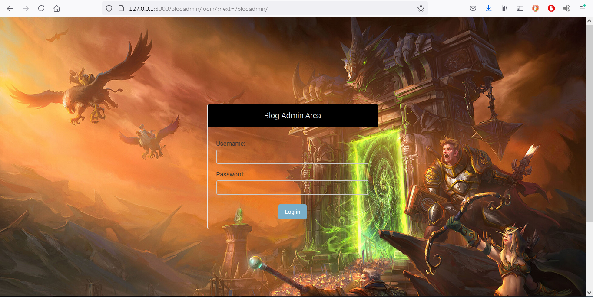

# django_admin_mastery

Exploring Django's Admin Site possibilities/features by following [Very Academy's](https://www.youtube.com/channel/UC1mxuk7tuQT2D0qTMgKji3w) - [Django Admin Series](https://www.youtube.com/watch?v=c_S0ZQs81XQ&list=PLOLrQ9Pn6cazhaxNDhcOIPYXt2zZhAXKO&ab_channel=VeryAcademy)

Summary:
```
- Customization
- Hooks
- Features
- Functions
- Adaptions
```

Topics covered:
```
1. Setup a custom admin sites
  - Setup a custom admin area
  - Overriding the default admin site
  - Setup multiple admin areas
  
2. Registering models to the admin site
  - Registering a model
  - Registering a model - Object -> Customisation
  - Registering all models
    -- unregister
    
3. ModelAdmin options (Field and Fieldset Customisation)
  - Selecting fields
  - Fieldsets
    -- Fields, Descriptions, Classes
  - Help Text
  - Building a custom form
  
4. Custom Login Page Template
5. Installing a Markdown Editor (django-summernote)

6. Django Admin filters
  -- Create simple filters
  -- Custom filter
  
7. Django Admin Template and CSS Overrides

8. Django Admin User Model Permission Overrides & Performing Extra Operations
  - Part 1:
    -- add   : ModelAdmin.has_add_permission()
    -- change: ModelAdmin.has_change_permission()
    -- delete: ModelAdmin.has_delete_permission()
    -- view  : ModelAdmin.has_view_permission()
  - Part 2:
    -- Extending permissions to provide additional functionality
      --- Decisions based upon user
  
9. Django Admin CSV file upload
```
Snapshot of blogadmin/ login page

